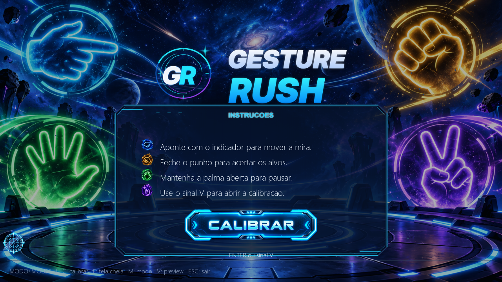
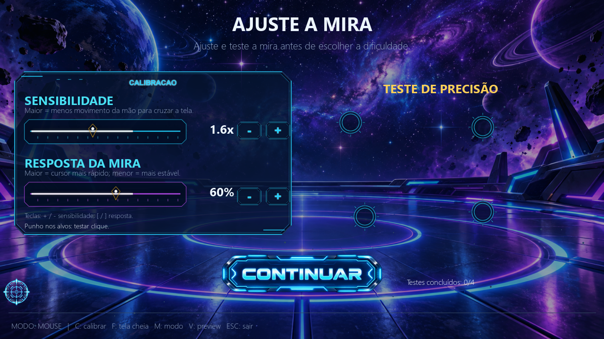
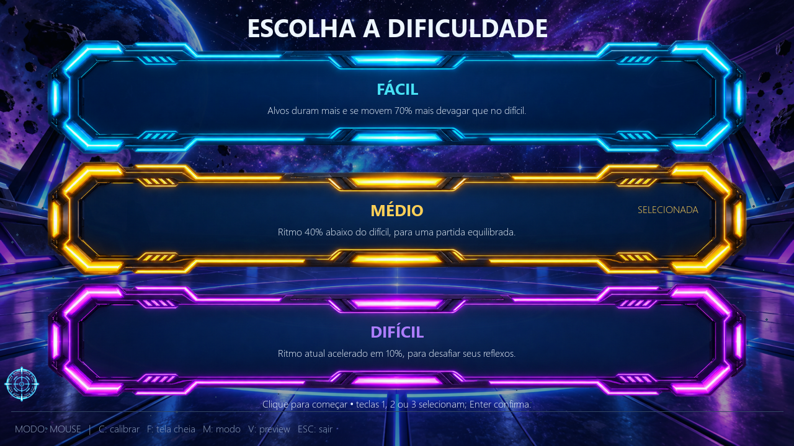
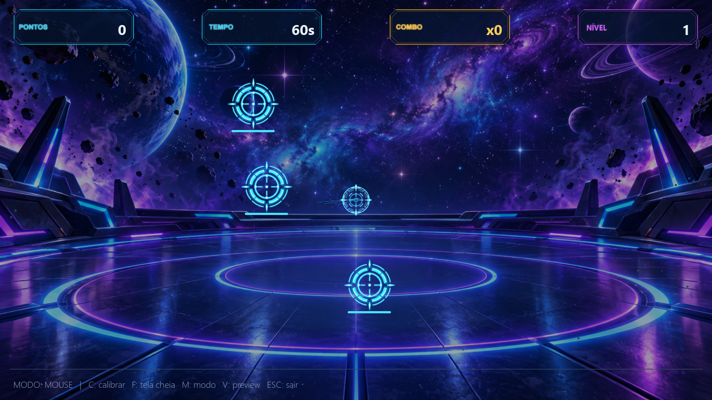
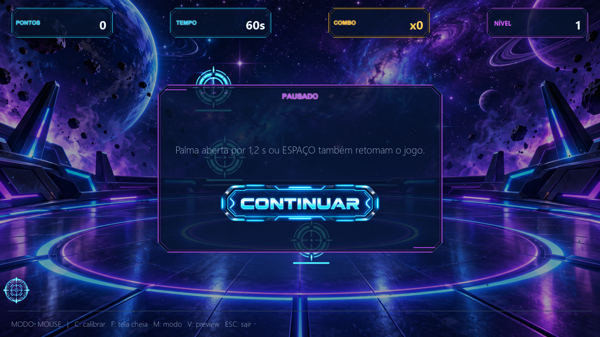

# Gesture Rush

**Gesture Rush** é um jogo arcade de reflexos criado para a Feira de ADS. Em uma arena sci-fi, você mira nos alvos usando os gestos da mão pela webcam ou, para demonstrações sem câmera, pelo mouse. Cada partida dura 60 segundos: acerte alvos, mantenha combos e tente colocar seu nome no ranking.

O jogo funciona offline durante a apresentação. A instalação das dependências e do modelo de reconhecimento da mão precisa ser preparada antes, com internet.

## Capturas do jogo

As imagens abaixo foram capturadas da interface do jogo em execução no modo mouse. Elas mostram telas reais do projeto, sem dados inventados de partida ou ranking.

<p align="center">
  
  
</p>
<p align="center">
  
  
</p>
<p align="center">
  
</p>

## Como é uma partida

1. **Menu:** veja os gestos principais e comece a configuração.
2. **Calibração:** ajuste a sensibilidade e a resposta da mira e experimente quatro alvos de treino.
3. **Dificuldade:** escolha Fácil, Médio ou Difícil.
4. **Arena:** durante 60 segundos, acerte os alvos antes que desapareçam. O HUD acompanha pontuação, tempo restante, combo e nível.
5. **Resultado:** informe um nome e salve a pontuação no Top 5 da categoria correspondente. Depois, você pode iniciar outra rodada.

### Alvos, pontos e progressão

- **Alvo normal:** 10 pontos base.
- **Alvo bônus:** 20 pontos base.
- **Combo:** cada acerto consecutivo acrescenta pontos aos próximos acertos, até o limite definido pelo jogo.
- **Alvo de perigo:** tira 15 pontos e interrompe o combo.
- Errar um disparo também interrompe o combo.
- O nível aumenta a cada sete acertos. A arena passa a ter mais alvos e, a partir do nível 3, pode aparecer o alvo de perigo; alvos móveis também ficam mais relevantes.

### Dificuldades

| Dificuldade | Ritmo relativo | O que muda |
|---|---:|---|
| Fácil | 0,33 | Alvos permanecem mais tempo na tela e se movem mais devagar. |
| Médio | 0,66 | Ritmo intermediário; vem selecionado por padrão. |
| Difícil | 1,10 | Ritmo 10% mais rápido que a referência atual do jogo. |

Os três modos mantêm a partida em 60 segundos. A diferença está no ritmo e na janela disponível para acertar cada alvo. Na tela de escolha, clique em uma opção ou use **1**, **2** ou **3**; pressione **Enter** para confirmar.

## Modos de controle

### Webcam e gestos

O MediaPipe detecta uma mão localmente no computador. O jogo não envia o vídeo para um servidor.

| Gesto | Ação |
|---|---|
| Apontar com o indicador | Move a mira. |
| Fechar o punho | Dispara uma vez; é necessário abrir a mão antes de disparar de novo. |
| Manter a palma aberta por 1,2 segundo | Pausa ou retoma a partida. |
| Manter o sinal de V por 1,2 segundo | Avança pelo fluxo de telas: calibração, dificuldade, partida e retorno após o resultado. |

Uma boa iluminação e manter a mão visível para a câmera ajudam o rastreamento. Pressione **M** para alternar entre webcam e mouse quando a câmera estiver disponível.

### Mouse

O mouse oferece uma forma simples de testar ou apresentar o jogo sem webcam: mova o ponteiro para mirar e clique para disparar. Use `--mouse` para iniciar diretamente nesse modo.

## Ranking e recordes

O ranking guarda seis Top 5 locais e independentes:

| Modo | Fácil | Médio | Difícil |
|---|---|---|---|
| Webcam | Quadro próprio | Quadro próprio | Quadro próprio |
| Mouse | Quadro próprio | Quadro próprio | Quadro próprio |

Se o controle mudar durante uma partida, o resultado é associado ao modo que estiver ativo ao final. A tela de resultado, a verificação de novo recorde e a gravação usam essa mesma categoria. A música de campeão também é acionada quando a pontuação entra no Top 5 correspondente.

Os dados ficam no arquivo `%LOCALAPPDATA%\GestureRush\ranking.json` no Windows. Pontuações antigas sem informação de modo ou dificuldade são mantidas no campo `legado`; o jogo não presume em qual quadro elas deveriam entrar.

## Trilha sonora

As sete músicas acompanham o estado do jogo:

| Tela ou momento | Faixa |
|---|---|
| Menu principal | Neon Awakening |
| Calibração e escolha da dificuldade | System Calibration |
| Partida | Reflex Overdrive |
| Últimos 10 segundos | Final Countdown |
| Pausa | Frozen Time |
| Resultado comum | Digital Results |
| Novo recorde no Top 5 da categoria | Neon Champion |

Se a máquina não tiver áudio disponível, o jogo continua funcionando.

## Teclado e atalhos

| Tecla ou controle | Ação |
|---|---|
| **Enter** | Avança pelo menu/configuração, confirma dificuldade ou salva o resultado. |
| **1 / 2 / 3** | Seleciona Fácil, Médio ou Difícil na tela de dificuldade. |
| **Espaço** | Pausa ou retoma a partida. |
| **C** | Abre a calibração. |
| **M** | Alterna entre webcam e mouse quando a webcam está disponível. |
| **V** | Mostra ou oculta o preview da webcam. |
| **F** | Alterna entre janela e tela cheia. |
| **Esc** | Sai do jogo. |
| **Backspace** | Apaga o último caractere do nome no resultado. |

Enquanto o campo de nome do resultado está ativo, as teclas são reservadas para digitação; os atalhos do jogo não interferem no nome. **Enter** salva a pontuação.

## Instalação e execução

### Windows

1. Instale o Python 3.11 e mantenha a opção de adicionar Python ao `PATH` habilitada.
2. Com internet, execute `instalar_windows.bat`. O instalador cria o ambiente virtual, instala as dependências e baixa o modelo oficial do MediaPipe.
3. Inicie pelo `jogar_windows.bat` para usar webcam, ou abra `jogar_windows.bat --mouse` para jogar sem câmera.

Instale e teste tudo antes da feira. Depois que dependências e modelo estiverem no computador, a partida não precisa de conexão com a internet.

### Executar pelo código-fonte

Com Python e as dependências instaladas:

```bash
python main.py             # tenta iniciar com a webcam padrão
python main.py --camera 1  # tenta usar outra câmera
python main.py --mouse     # inicia sem webcam/MediaPipe
python main.py --sem-preview
```

O arquivo do modelo de mão precisa estar em `modelos/hand_landmarker.task`. Se ele não estiver disponível, execute `python baixar_modelo.py` antes da apresentação, com internet.

No Linux, use `python3` e instale as bibliotecas de sistema necessárias ao Pygame, OpenCV e MediaPipe na distribuição escolhida. O código-fonte oferece o modo mouse; webcam, áudio e dependências precisam ser conferidos no computador Linux de destino.

### Gerar o executável no Windows

1. Garanta que `modelos/hand_landmarker.task` esteja presente.
2. Execute `instalar_windows.bat` para instalar dependências e preparar o modelo.
3. Execute `gerar_exe_windows.bat`.

A saída esperada é `dist\GestureRush\GestureRush.exe`. Distribua a pasta inteira `dist\GestureRush`, pois o executável precisa dos arquivos ao lado dele.

## Tecnologias e organização

- **Python**, **Pygame** e **MediaPipe**.
- **OpenCV** para acesso local à webcam.
- Arquivos de ranking e ajustes em JSON no computador do jogador.
- Assets do jogo em `assets/definitivos/`, separados em fundos, botões, calibração, dificuldade, efeitos, feedback, marca, painéis e áudio.
- Lógica independente da interface em `logica.py`; jogo e telas em `main.py`.

## Privacidade e funcionamento offline

- O vídeo da webcam é processado localmente para reconhecer a mão.
- O jogo não envia nem salva imagens da câmera.
- Durante a apresentação, não há chamadas de rede; instale as dependências e baixe o modelo antes.
- Pontuações e configurações ficam em arquivos locais no computador.

## Verificação e limitações

As capturas desta página foram geradas pelas telas reais do jogo em modo mouse. As regras, o fluxo de telas e o empacotamento para Windows foram verificados durante o desenvolvimento. A experiência final ainda deve ser conferida na máquina da apresentação, especialmente webcam, iluminação, áudio físico e uma partida completa.

Para acompanhar o que ainda falta, consulte [`TASKS.md`](TASKS.md). O histórico de alterações está em [`PROJECT_LOG.md`](PROJECT_LOG.md).
